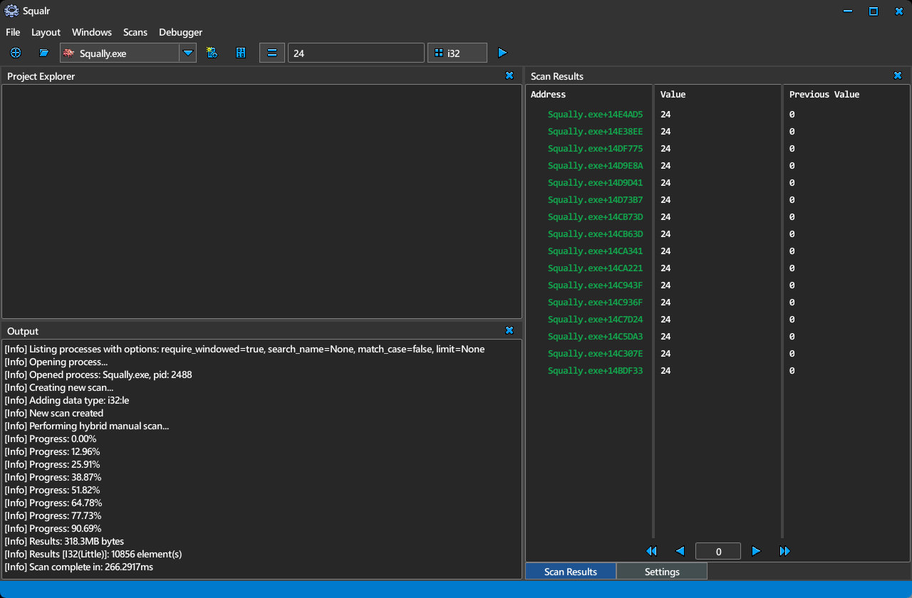

# Squalr

[Squalr Official Website](https://www.squalr.com)

Join us on our [Discord Channel](https://discord.gg/Pq2msTx)

**Squalr** is a highly performant dynamic analysis reverse-engineering tool written in Rust.

First and foremost, Squalr is a lightning fast memory scanner, allowing the user to search for and modify running process memory. Fast scans are achieved through multi-threading combined with SIMD, allowing it to rip through multiple GBs of data in seconds. While all CPUs are supported, for maximum performance your CPU needs support for SSE, AVX, or AVX-512.

Dynamic analysis is a first-class citizen in Squalr, unlike most reverse-engineering tools. This allows for workflows that simply are not possible otherwise by analyzing how a program behaves over time.

-----------------------

Squalr is a spiritual successor to Squalr-Sharp. Looking for the old C# repo? See [Squalr-Sharp](https://github.com/Squalr/Squalr-Sharp). Note that Squalr-Sharp is no longer maintained, as Squalr has become the focus.

This project is unaffiliated with any employers of our team members, past, present, or future.

## Development Philosophy
Systems level work demands a systems level language. Rust was chosen because it eliminates entire classes of bugs and is perfectly suited to the job.

After evaluating several front-end frameworks, we settled on egui. Egui gives us small binary sizes, native speeds, cross-platform, and ease of accessing application data for display.

Medium term, Squalr aims to be extensible with a modern plugin system. No more unzipping plugins to esoteric locations and manually upgrading them each release. This means an actual marketplace, including plenty of free and easy to install plugins. While not there yet, Squalr is being developed knowing that developers will want to be able to extend the type system, project system, register custom tools, and register middleware to support scanning emulator memory or other niche use cases.

Additionally, we will soon want to support scripting. We have not yet decided on a language. While most people instantly jump to Lua or Python, these languages lack robust data types, which results in awkward work-arounds. Consequentially, it is unclear what we intend to use instead, or if there are viable alternatives at all.

Eventually Squalr will eventually compete on the static front, but not initially. For now, Squalr is deliberately not building out an ASM to C++ decompiler, a code graph, nor a debugger.

Long term, we do wish to integrate into the AI landscape, in a manner that actually delivers value to users. These are a few ideas that we intend to try:
- Plaintext hacking. Just tell the agent what you want to hack over a normal conversation, and have it dispatch low-level commands to do the heavy lifting. This can be very effective in domains like video game reverse-engineering.
- Automated data symbol discovery. By analyzing how values change over snapshots in time, analyzing screenshots, etc., we believe that agents can help you build a full map of all data and functions in a process.
- Low-latency local models. We want developers to be able to make bots that can take in screen data, memory data, and run this in a rapid enough loop to do everything from play games, to navigate desktop software, without exessive delays.

## Features

### Builds
- [X] Desktop GUI build.
- [X] Android GUI build.
- [X] CLI build.
- [X] TUI build.

### Developer-Facing Features
- [ ] Command/event hooks
- [ ] Plugin system: Data Types
- [ ] Plugin system: Middleware (Filters for emu support, filter down virtual memory through custom logic)
- [ ] Plugin system: Virtual Modules (custom defined static bases -- could be threadstack, special emulator memory regions, etc)
- [ ] Plugin system: Project item types
- [ ] Scripting system (exact language TBD)
- [ ] MCP APIs for LLM integrations (Needs architecting work)

### User-Facing Features
- [X] Primitive scans
- [X] Array scans, including arrays of primitives (ie u8[], i32[], string_utf8[])
- [X] String scans
- [X] Struct viewer
- [X] Dockable window system
- [ ] Struct scans
- [ ] Pointer scans
- [X] Project system

## Architectural Overview

### Command Response System
Squalr has two components, a privileged interface, and an unprivileged core. This naturally gives rise to a command/response architecture, which makes for clear separation of concerns. To do this cleanly, we use structopts to make all commands have a text input equivalent, meaning that both a GUI and CLI can invoke the command fairly easily.

This allows us to create several different modes, such as a unified GUI/CLI/TUI build, an MPC shell, and a potential remote host to control a remote shell or MPC endpoint.

| Platform   | GUI   | CLI   | TUI   | MCP    | Remote (Host)   | Remote (Shell)   |
| ---------- | ----- | ----- | ----- | ------ | --------------- | ---------------- |
| Desktop    | ✅    | ✅    | ✅    | ✅     | ✅              | ✅               |
| Android    | ✅    | ✅    | ✅    | ✅     | ❌              | ✅               |
| iPhone (Not Available Yet)     | ✅    | ✅    | ✅    | ✅     | ❌              | ✅               |

### Architecture Glossary
- A **snapshot** is a full query of all virtual memory regions in an internal process. This is created in two passes, once to determine the virtual page addresses and sizes, and another pass to collect the values.
- An **snapshot region** represents a continuous range of virtual memory regions. For example, virtual memory pages of 0x1000-0x2000, 0x2000-0x3000, merge to become a single snapshot region of 0x1000-0x3000, with some internal bookkeeping to track the merges. The merging is important to allow easy scanning across virtual pages (ie scanning for an array of bytes that may span multiple virtual pages). More info on this in the `Snapshot System` section.
- An **snapshot filter** represents a window into a snapshot region, and are created by scan implementations. These can be considered as an compact collection of scan results represented as a range.
- An **scan result** is the value obtained when indexing into a snapshot region through a snapshot filter. These are fairly expensive to produce since it requires some seeking logic and deserialization of bytes, so these are created on-demand by CLI/GUI displays.
- An **element** an abstract concept similar to a scan result, but more generally just refers to an arbitrary value within a filter. While this does not exist as a concrete type, this is commonly used in the code conceptually. Elements are best illustrated by example: if scanning for a 1-byte value over a 2000 byte region of memory, with an alignment of 2-bytes, we expect to find 1000 elements. Now, if our value is 4-bytes, this changes the element count to 997. This is because the 4-byte value cannot read outside of the region bounds!

### Snapshot System
The snapshot system is designed to intelligently snapshot process memory, while arranging the memory in a way that is optimal for scans. This is done by merging adjacent virtual memory pages. For example, if we have 3 back to back region of 0x2000 length, then this yeilds a single 0x6000 region. We still split up the process memory read calls, but we read the bytes directly into the larger array at the correct indicies.

This has a few advantages. First, scans no longer need to worry about edge conditions. Scanning for an array of bytes that crosses a page boundary is trivially supported!

The only complexity is that if one of the read memory calls fail, we need to then split this region and consider the unread portion as tombstoned.

Additionally, we use a "red black" system for snapshot results. The first two times we take a snapshot, we have to allocate memory, but for subsequent snapshots we can simply reuse existing arrays.

A potential optimization is deciding when to shard snapshot regions. Currently, if we had a 1GB snapshot region, but only 2 filters: one at the beginning and one at the end end, we would still read all the memory between these filters on subsequent scans. This is rare in practice and a bit premature to solve now, so it is left as is.

### Scan Filter System
Scan results are discovered through the concepts of filters. This is a clever way to support many simultaneous scans, of various data types. Once we have a snapshot, we can then interpret the bytes in many different ways. For example, we can scan for the value 1 as an i8, i16, i32, i64, u8, u16, u32, u64, f32, and f64! We just create a new set of filters for each data type. This is also extremely parallelizable, especially when coupled with SIMD friendly scans.

In fact, the entire bottleneck of the scan system is in value collection. Reading process memory takes far more time than scanning for every single data type, even when scanning with 1-byte alignment.

Additionally, filters are tracked as a Vec of Vecs as a scanning optimization. This allows us to rip through each snapshot region in parallel (the high level Vec), and then collect the results into a Vec for each of these regions. This avoids any painful runtime bottlenecks of reorganizing this information into a "cleaner" form later.

### Scan Run-Length Encoder
The way that scan works is through a run-length encoding algorithm. This allows for extreme compression of scan results. The vast majority of most process memory is 0x00, and the distribution of bytes is heavily skewed to other common values like 0x01 and 0xFF. So if we scanned a region of memory for the value 0x00, and that region was entirely zeros with a size 0x2000 at address 0x10000, it would yield a single result of (0x10000, 0x2000).

Even better, using a run length encoder allows us to very quickly discard non-matching results. For example, if scanning for the value 1 as an i32, most of the memory will be 0. When we do a SIMD comparison, most of the SIMD vectors will be entirely false since all of the comparisons are likely to fail, allowing us to skip SIMD-sized chunks in our run length encoder. Even better, we can do the same for matches! If scanning for 0, we expect to get many full matches, allowing us to encode SIMD sized chunks in a positive way as well. This allows us to gain extremely high throughput on scans.

Additionally, other features like alignment allow us to skip elements and avoid fragmentation. Imagine we scanned for a 1-byte value of 0x00 in a massive 1GB region of memory that was simply 0x00 and 0xFF alternating, but we scan with an alignment of 2-bytes. One would expect fragmented scan results with a significant number of filters, but we can avoid this! This is done by storing the alignment. Because of this, we actually would store 1 result to cover this entire region!

Now, when we index into the filter to retrieve a result, we always step by the alignment, dodging all of these ignored 0xFF values.

### Scan Results
Scan results cost no meaningful space overhead. Space is scarce, as we already store huge snapshots of process RAM. Consequentially, we prefer to avoid using extra space wherever possible. Instead, we rely on basic search aligorithms to extract paginated scan results. For example, once a scan completes, each snapshot region now has a collection of snapshot filters organized by data type, as well as extra data like the alignment. We can derive the number of scan results based on the data type, the size of the filters, and the alignment. This value is cached within the snapshot filter collection. Fetching a scan result is done in an efficient two step algorithm:
1) Linear seek to the snapshot region containing the nth result for a specified data type. This can be done quickly, as each snapshot region tracks the number of results in its filters for each data type. There are not enough snapshot regions to ever warrant storing extra data and switching to a binary search. Linear is fine.
2) Linear seek to the window containing the nth result. Similar to above, this is also fast.

Coupled with pagination, this is lightning fast without needing to store extra data within our snapshot filters. We can store some data at the filter collection level, but this is fine since we only expect to have ~10 filter collections max at any given time.

// TODO: Currently we actually construct a heap and do a binary search try to combine multiple scan results across data types into the same results. We actually are better off omitting this and sticking to the dual linear seek solution above, and keeping data types as separate tabs of results. Maybe. It could be worth zippering the results together if we can keep the efficiency good, but I'll have to think on it more.

### Scan Rules Engine
All scans are decomposed into an intermediate form, allowing for us to choose an optimal scan strategy for maximum throughput. Many factors are considered, such as:
- The size of the region being scanned, and whether it fits in a 512, 256, or 128 bit SIMD register.
- Whether the value has a tolerance, ie floats.
- Whether the value has optimizable features. Examples:
    - If scanning for i32 of value 0, but with 1-byte alignment, then we actually decompose this into a scan for u8 == 0, and can leverage our run length encoder to discard all regions less than i32 in size (4 bytes). This is substantially more SIMD friendly, as we no longer need to keep shifting our SIMD register over by 1, instead we can load and compare large chunks at a time.
    - If scanning for u32 > 0, then we can actually reframe this as u32 != 0. Then this actually decomposes into the rule above, allowing us to do 1-byte checks with RLE discard! As you can see, many rules can chain together to yield much faster scans.
    - If scanning for a 4-byte values like 0x12341234, but 2-byte aligned, we can gain significant performance by decomposing this into 0x1234 of 2-bytes. This is referred to as **periodicity** internally. Again, we use the RLE discard trick to throw away regions less than 4-bytes since we can get a few false positive 2-byte matches. This again avoids overlapping, and we no longer need to shift our SIMD register.

### Scan Implementations
Internally, we use the rules engine above to select a scanner implementation for each snapshot filter under consideration. Note that scans operate on snapshot filters, not snapshot regions. For the first scan, the snapshot filter will encompass the entire snapshot region. For subsequent scans, as the results are wittled down, the scan implementations scan smaller and smaller filters.

This is why selecting the best scanner is crucial, we have many such as:
- Single scalar element scanner: Just scans 1 element, using direct scalar comparisons for values.
- Iterative scalar element scanner: Scans for values, one element at a time. Necessary when the chunk does not fit into a SIMD register. Also considered the gold standard implementation, which other scanners can be evaluated against with the 'Enable shadow scan' setting, which logs errors if the advanced scanner produces different results than this one.
- Vector scanner (sparse): Performs a SIMD masked scan that skips in-between elements based on alignment, ie scanning for an i32 with an 8-byte alignment.
- Vector scanner (aligned): Performs a SIMD scan for perfectly aligned values, ie scanning for a u8 with 1-byte alignment, or an i16 with 2-byte alignment, or u32 with 4-byte alignment, etc.
- Vector scanner (overlapping): Performs a SIMD scan for overlapping values, ie scanning for an i32 with a 2-byte alignment. This combines scan results by loading multiple vectors, shifting some of them, and ORing the results together. Slower than the other SIMD scans, but still reasonably fast.
- Vector scanner (overlapping periodic): Performs a SIMD overlapping scan, but discards run lengths below a specified size as part of the periodic optimization mentioned earlier.
- Booyer-Moore: Performs an arbitrary array of byte scan, using the scalar Booyer-Moore search algorithm.

## Launch Tasklist
- [X] Custom installer and auto updater from Git tags.
- [X] Dockable window system.
- [X] Dependency Injection framework for GUI and engine.
- [X] Command/Response system, with IPC support for rooted Android devices.
- [X] Scan result display.
- [X] Integer Scans.
- [X] Float Scans.
- [X] Big Endian Scans.
- [X] Vector Aligned Scans.
- [X] DataValueBox support for entering scan values (Supporting arrays, bin, and hex).
- [X] Sparse Scans.
- [X] Array of byte scans.
- [X] Vectorized overlapping scans.
- [X] Periodic Vectorized overlapping scans.
- [X] Settings system that respects command/response, IPC, etc.
- [X] Freezing/deleting scan results directly from scan window.
- [X] String scans.
- [X] Robust conversion framework.
- [X] Separate data types for various string encodings (and remove old string encodings -- separate data types is cleaner).
- [X] Generic array scanning system (ie scan for array of floats, array of ints, array of strings...)
- [X] Struct viewer in the GUI that can register an active set of properties.
- [X] Display type switching for struct viewer data types.
- [X] String-based editing / committing of struct viewer entries.
- [X] Projects with a per-file backing. Freezable addresses. Sortable.
- [X] Editing scan results directly (via struct viewer).

## Post-Launch Tasklist
Lower priority features that we can defer, for now.

Post-launch Features:
- [ ] Struct Scans.
- [ ] Improve coverage of conversion framework.
- [ ] More string encodings
- [ ] Custom and built in editors for property viewer data types.
- [ ] Deleting scan results directly.
- [ ] Case insensitive string scans.
- [ ] Tolerance handling for float array scans.
- [ ] Pointer Scans.
- [ ] Memory viewer.
- [ ] Masked byte scans.
- [ ] Bitfield scans.
- [ ] Plugin system for new data types. The engine is already designed with this feature in mind, so actually this should be fairly easy.
- [ ] Plugin system to support emulator middleware (ie filtering queried virtual memory, remapping virtual address space, etc).
- [ ] Plugin system to support virtual modules. Very similar to above, but registering fake modules, with emulators again being the primary use case.
- [ ] Plugin system for new project item types (ie supporting a .NET item, or a JRE item).
- [ ] Finish trackable task system to support cancellation, progress bars, etc.
- [ ] Registerable editors in the property viewer. NOT pop-up based though (to support mobile), instead as a take-over screen on the property editor panel.
- [ ] Git(hub) integration?

## Unsolved architectural challenges
- Should we allow engine event hooking? If we support plugins later, this might prove valuable. But lambdas are stored almost exclusively as FnOnce for easier stack capture. It also muddies the command/response architecture a bit.
- How should we allow plugins to register custom windows? We would probably need to expose supported egui controls in some way, or expose this over some sort of gui-only API.
- How would we allow plugins to register custom editors for custom data types? Similar challenges to custom windows.

## BRAIN DUMP
Project Items can be future proofed to a large degree by basically inheriting a basic trait for hooking into get/set activated, and storing arbitrary key value pairs.

Each project just has its set of keys it cares about (ie for AddressItem, its the address, any module info, etc).

Some care must be taken to support storing structs in an AddressItem, ie this would mean that its not really a DataValue that is stored, but a ValuedStruct, which may have a single DataValue in most cases (for single value storage). Probably an anonymous struct, although it should support registered symbols as well.

Now, making this not agonizing from a UX perspective is key. All data types are already in the symbol registry, so thats fine. If we just stored a single symbol ref for address items, that would generally solve all cases except for the anonymous case, in which case the struct would need to be fully serialized into the item. Kinda shitty.

Forcing the user to make new struct types isn't necessarily bad either (again, how often are people scanning for structs anyways?).

Needs some thinking, but this can be deferred to quite some time after release probably.

===

Valued Structs are particularly obnoxious. Supporting nesting seems strange and perhaps stupid, but it may be necessary (basically a JSON editor GUI). The ValuedStructField feels pretty much the same as a data value, with just a small amount of extra metadata like readonly, and nesting support (which *maybe* can be done with DataValues themselves but thats complicated).

Additionally, the concept of DataValueInterpreters is jarring.

I think we may be able to scrap the concept and just operate on Anonymous Values, and each DataType supports deanonymize values and supported interpretation types.

We then only really need to pass a string ref and format type into the DataType and get a Result<DataValue>. Possibly even support update-in-place to avoid reallocing a bunch of data values.

I think we may also be able to simplify how Anonymous Values work. In reality, its a string + a format + an optional flag for arrays.

And now we have the remaining problem of DataValue -> Display String and all we have for display is this AnonymousStringValueFormat. Is DataValue -> AnonymousString even correct? Should we bundle the format into the string? Is re-anonymizing a thing? And presumably it just maps to a generic string format type (ie not decimal, but leave it vague).

At least if we re-anonymize we get to keep the current display format, which conversions can use to say "actually take this anonymous string as type x, convert to data value, then back to a an anonymous string of type y"

Seems like no real downsides from a comprehension point of view.

===

Struct scans will be very challenging. Imagine scanning for {float} {float} {float}, ie XYZ coordinates as a struct. You can't just serialize to bytes and scan for them, due to floating point tolerance. Even worse, if you did X > 2000, Y < 500, Z > 0, this necessitates per-field handling.

Our existing architecture is quite flexible, but this definitely requires a special scanner implementation, and it is highly unlikely to benefit from any of the rules engine optimizations.

## Detailed Tasklist
This is a highly descriptive list of tasks to be implemented, with enough detail such that an agent should be able to audit the codebase and come up with a plan.

### Symbol Registry
Branch: `pr/symbol-registry`
We need a robust symbol system that allows for registering custom structs and data types for quick lookup. This can be tricky due to the need for both privileged and unprivileged domains requiring access to the symbol registry. See Registry Synchronization section.

### Scan Result Deletion
Branch: `pr/scan-result-deletion`

We need to support deleting specific scan results. The internal data structures for storing scan results are not robust to this operation, so it actually makes more sense to manually track deletions rather than rebuilding all scan result data structures after a delete. Instead, we store deletions and use this information to intelligently skip entries when seeking to scan results by page.

### Android Build
Branch: `pr/android`
The android build should be made functional again. Note that unlike the main gui build, this must run in IPC mode with a privileged shell rather than standalone.

This was once fully functional for querying processes, but this was using Slint for the GUI, and we have since moved to egui.

This will require a bit of a revival.

### Draggable Docking Windows
Branch: `pr/docking`

Our docking system is quite robust, but we currently do not support changing the layout with drag/drop. The operations already exist to reparent and move windows around, so this may not be terribly bad. The tricky parts are the visual updates (ie while dragging something, show a blue sheen over drop targets that indicate where the docked window will insert).

### Conversion Testing
Branch: `pr/conversion-testing`

The conversions in the squalr-engine-api should probably have a dedicated test suite.

Additionally, conversions should be architecturally audited for robustness.

### Pointer Scanning
Branch: `pr/pointer-scanning`

Pointer scans need to be implemented. The actual algorithm is too complex for an agent, as this is on the cutting edge of knowledge, but the APIs can be made, and it can be co-authored with an agent.

### Release Test
Branch: `pr/linux`

We need a functional Linux build

### Release Test
Branch: `pr/macos`

We need a functional MacOS build. Not sure how feasible this is with Mac security features.

### Release Test
Branch: `pr/release-test`

We need to orchestrate a full attempt at a v1.0.0 release to see how the process goes.

### Engine Event Hooks
Branch: `pr/engine-event-hooks`

When the engine emits events, it would be nice for listeners and plugins to hook into these.

### Registry Synchronization
Branch: `pr/registry-synchronization`

Currently, there is a global singleton of the registry that exists for both the unprivileged side, and the privileged side. In a standalone build, this is the same registry, with only one instance.

This is not a system that makes sense for a long term plugin based approach. Ideally, plugins could register new things to the registries, and then this would be synchronized with the unprivileged GUI.

This needs to be done such that the GUI can make snap decisions without chatty traffic to the privileged side.

Very challenging task.
